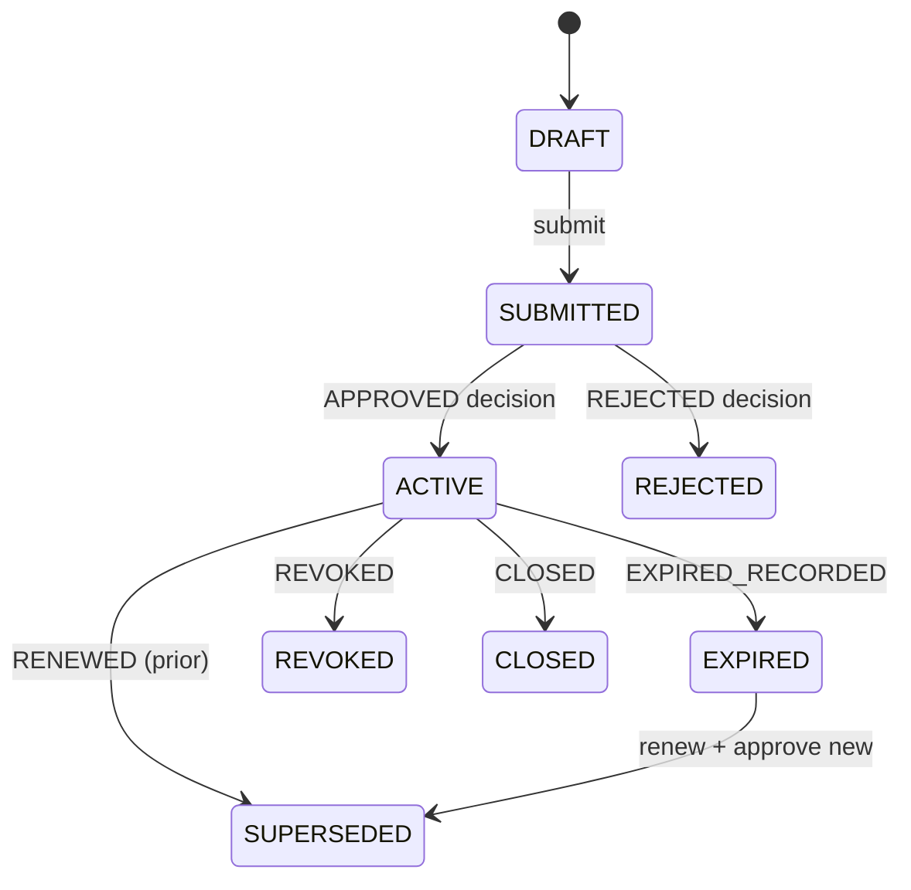

# PAR-EXC-001 — Target Exception model

**Status:** Implemented additively (schema + service); production path cutover **not** done  
**Domain authority:** CANONICAL_DOMAIN_MODEL §2.33 — “temporary approved deviation from platform governance”  
**ADR:** ADR-0015 **Proposed**

## Entities

### ExceptionRequest

Open or active governed deviation.

| Field | Role |
|---|---|
| `organization` | Tenant boundary (required) |
| `category` | POLICY / APPROVAL / WORKFLOW / DEADLINE / SECURITY / SIGNATURE / ADMINISTRATIVE / REPAIR / FEATURE_FLAG / RISK_ACCEPTANCE / AUDIT_FINDING / OTHER |
| `title`, `reason` | Human-readable deviation |
| `scope_type` + `scope_object_model` + `scope_object_id` + `scope_reference` | Explicit scope |
| `contract` | Optional binding when scope is contract-related |
| `requester`, `owner` | Who asked / who owns the risk |
| `authority_basis`, `authority_reference`, `designated_approver` | Explicit approval authority |
| `risk_classification` | LOW / MEDIUM / HIGH / CRITICAL |
| `bypasses_critical_security_control` | Forces Security approval on APPROVED |
| `compensating_controls` | Required while active |
| `granted_privileges` | Explicit privilege tokens only (closed catalogue) |
| `is_permanent`, `starts_at`, `expires_at` | Temporary by default |
| `status` | DRAFT → SUBMITTED → ACTIVE / REJECTED / EXPIRED / REVOKED / CLOSED / SUPERSEDED |
| `renewed_from` | Prior exception for renewal chain |
| `legacy_source`, `legacy_reference` | Discovery path linkage (e.g. EXC-POL-001) |

### ExceptionDecision

Immutable history row.

| Field | Role |
|---|---|
| `outcome` | APPROVED / REJECTED / RENEWED / CLOSED / REVOKED / EXPIRED_RECORDED |
| `decided_by`, `authority_basis`, `authority_holder_id` | Who decided under what authority |
| `security_approval` | Explicit Security sign-off |
| `compensating_controls_at_decision`, `granted_privileges_at_decision` | Snapshot at decision |
| `starts_at`, `expires_at`, `is_permanent_approved` | Window authorized by the decision |
| Immutability | `save` + `QuerySet.update` blocked for immutable fields |

## Status machine (simplified)



## Applicability rule

```text
applicable ⇔ status ∈ {APPROVED, ACTIVE}
            ∧ now ≥ starts_at
            ∧ (is_permanent ∨ (expires_at ≠ null ∧ now ≤ expires_at))
```

`privilege_granted(exc, token)` requires applicability **and** token ∈ `granted_privileges`.

## Invariants

1. Exceptions are temporary unless explicitly approved permanent.
2. Every exception has an owner and (unless permanent) an expiry.
3. Approval authority must be explicit.
4. An exception cannot silently grant unrelated privileges.
5. Expired exceptions stop applying.
6. Renewal creates a new ExceptionRequest + governed decisions.
7. Historical decisions are immutable.
8. Cross-tenant exceptions are prohibited.
9. UI visibility is not authorization.
10. Critical security-control bypass requires explicit Security approval (`security_approval=True`).

## Audit events

| Event | When |
|---|---|
| `exception.request.created` | Draft create |
| `exception.request.submitted` | Submitted create |
| `exception.decision.recorded` | Immutable decision |
| `exception.request.expired` | Temporal expiry recorded |
| `exception.request.renewed` | Renewal request created |
| `exception.cross_tenant.denied` | Cross-tenant attempt blocked |

## Privilege catalogue (initial)

`policy.deviation`, `approval.defer_blocker`, `workflow.bypass_step`, `deadline.extend`, `signature.alternate_path`, `risk.accept`, `audit.defer_finding`, `repair.provenance`, `feature.pilot_allow`

Unknown tokens are rejected.

## Out of scope until cutover authorization

Legacy paths continue to write their own statuses/audits. Dual-read adapters and production wiring are a later authorized slice under this same PAR-EXC-001 (status remains In progress).
